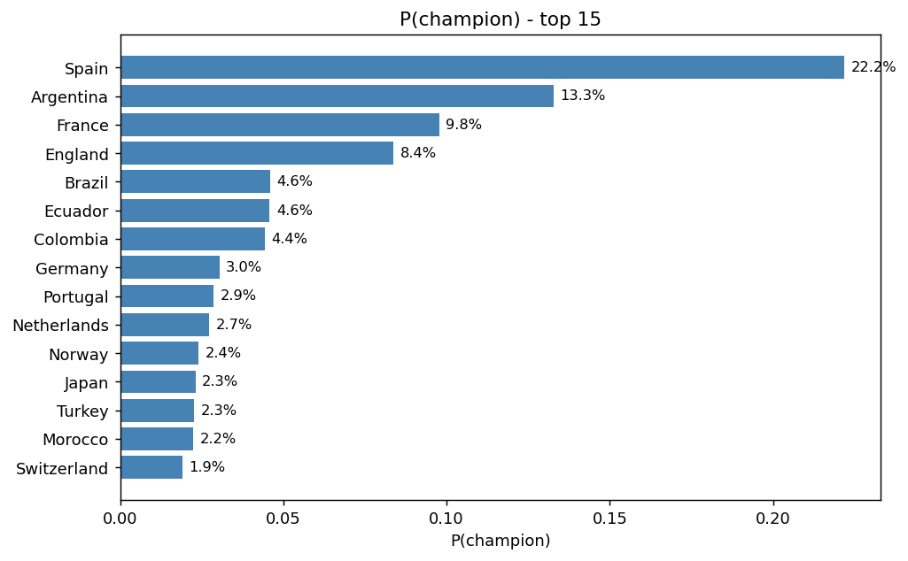
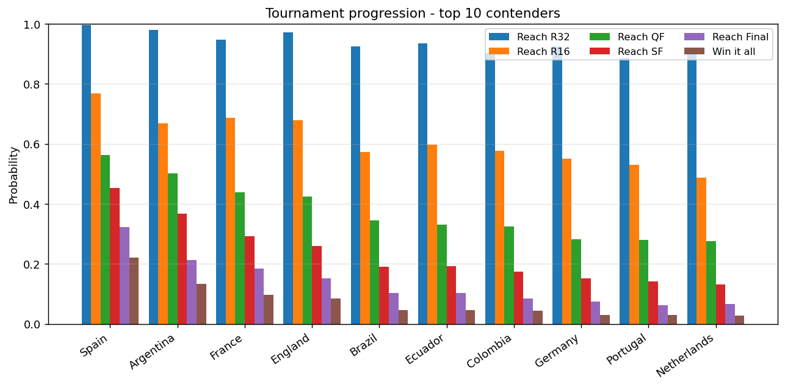
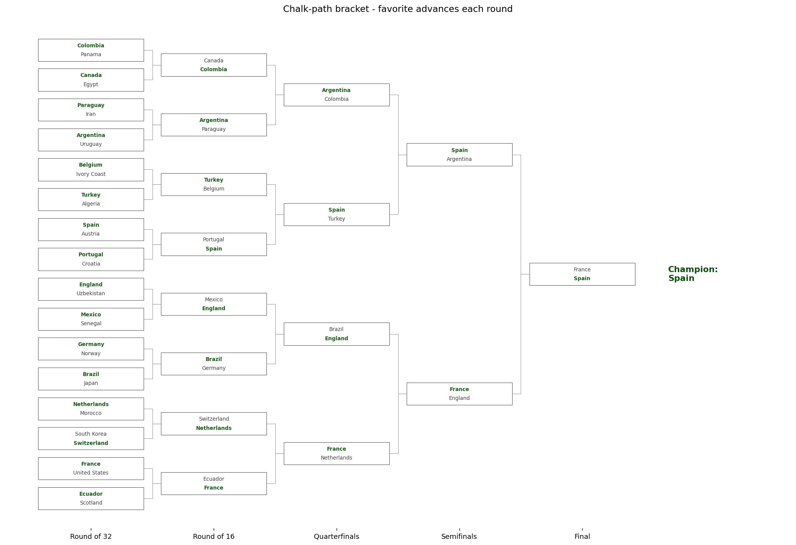
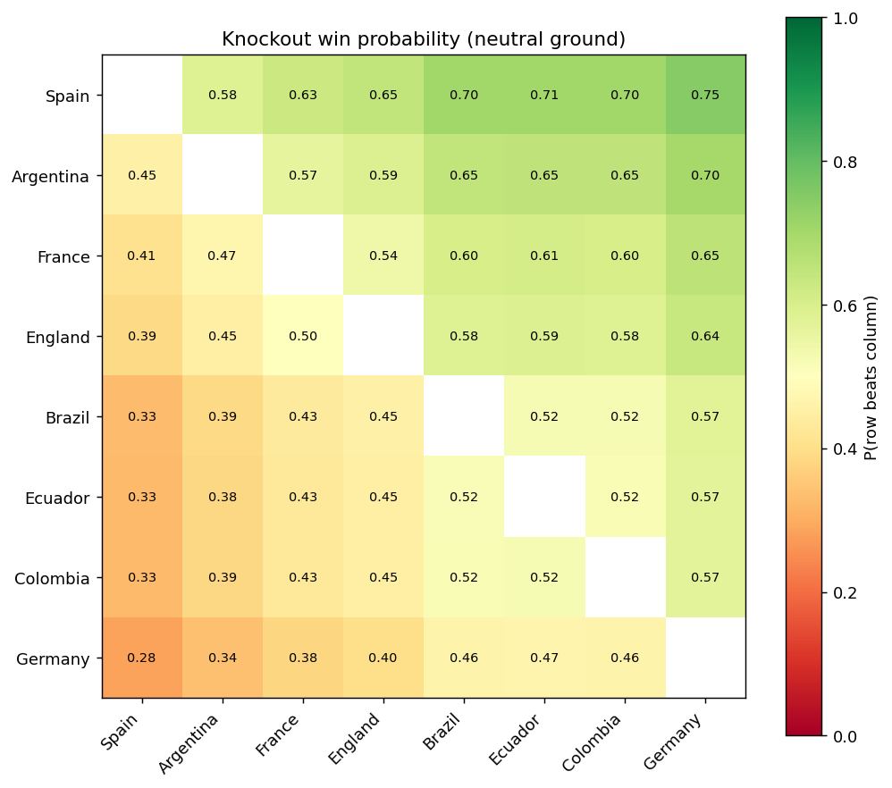
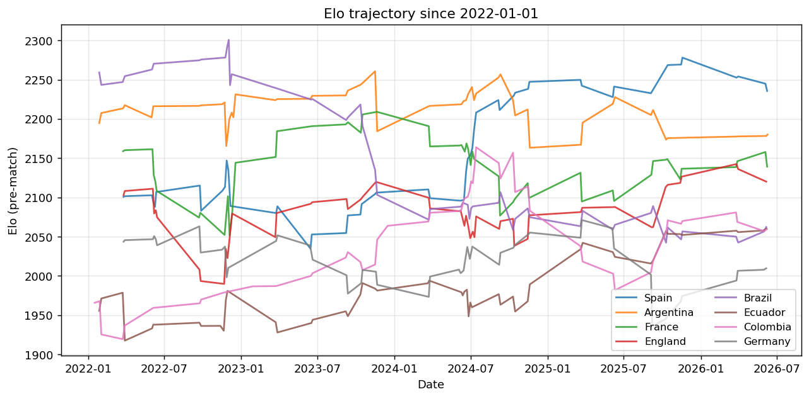
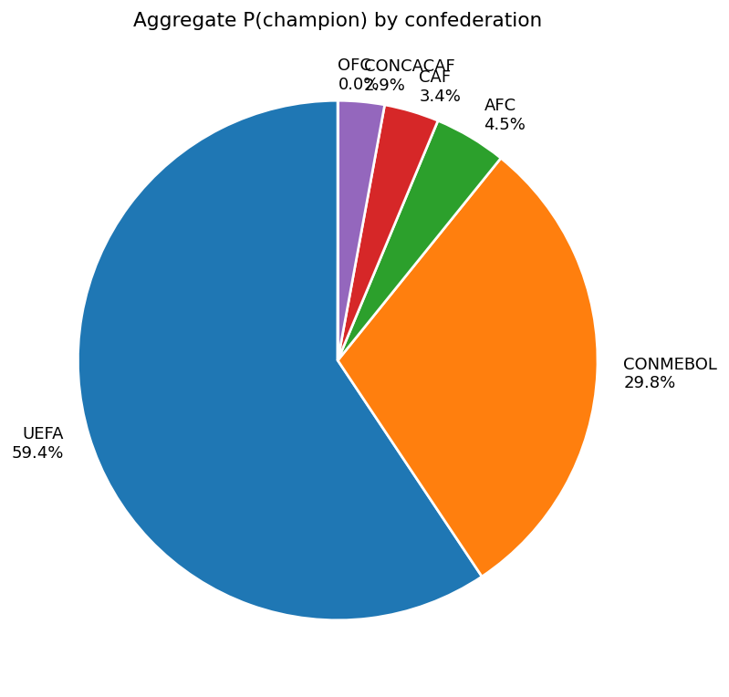

# FIFA World Cup 2026 - Prediction Report

*Generated: 2026-06-11 01:00*
*Methodology: World Football Elo + multinomial logit + 10,000 Monte Carlo simulations*
*Backtest validation: 2022 (Argentina ranked #2 - methodology has signal)*

---

## Executive summary

- **Predicted champion**: Spain (22.2%)
- **Top 5**: **Spain** (22.2%), **Argentina** (13.3%), **France** (9.8%), **England** (8.4%), **Brazil** (4.6%)
- **Chalk-path final**: France vs Spain -> Spain
- **Chalk-path third place**: England vs Argentina -> Argentina
- **Chalk-path semifinals**: France vs England | Spain vs Argentina
- **Surprise teams in top 15**: Ecuador (4.6%), Norway (2.4%), Turkey (2.3%), Morocco (2.2%), Switzerland (1.9%)
- **Bracket asymmetry**: upper half holds 45% of total P(champion); lower half 54%. The lower bracket is meaningfully stronger - bottom-half teams face tougher paths.

## Top 15 contenders

| team        |      elo |   P(R16) |   P(QF) |   P(SF) |   P(F) |   P(Champ) |
|:------------|---------:|---------:|--------:|--------:|-------:|-----------:|
| Spain       | 2237.652 |    0.767 |   0.564 |   0.453 |  0.322 |      0.222 |
| Argentina   | 2181.704 |    0.668 |   0.502 |   0.366 |  0.212 |      0.133 |
| France      | 2140.419 |    0.688 |   0.439 |   0.292 |  0.183 |      0.098 |
| England     | 2122.304 |    0.679 |   0.425 |   0.260 |  0.152 |      0.084 |
| Brazil      | 2066.380 |    0.574 |   0.346 |   0.190 |  0.102 |      0.046 |
| Ecuador     | 2063.400 |    0.598 |   0.332 |   0.192 |  0.102 |      0.046 |
| Colombia    | 2065.003 |    0.578 |   0.324 |   0.175 |  0.085 |      0.044 |
| Germany     | 2017.908 |    0.550 |   0.282 |   0.152 |  0.074 |      0.030 |
| Portugal    | 2027.514 |    0.530 |   0.280 |   0.141 |  0.062 |      0.029 |
| Netherlands | 2018.427 |    0.487 |   0.276 |   0.132 |  0.065 |      0.027 |
| Norway      | 2023.785 |    0.485 |   0.249 |   0.130 |  0.061 |      0.024 |
| Japan       | 2013.935 |    0.468 |   0.260 |   0.124 |  0.058 |      0.023 |
| Turkey      | 2009.828 |    0.487 |   0.252 |   0.112 |  0.049 |      0.023 |
| Morocco     | 2007.360 |    0.466 |   0.253 |   0.120 |  0.055 |      0.022 |
| Switzerland | 1975.521 |    0.568 |   0.282 |   0.111 |  0.046 |      0.019 |

## Tournament progression funnel

The funnel decomposes each contender's championship probability by stage. A large drop between consecutive bars marks the round where that team typically gets eliminated. Teams whose P(reach R16) is high but P(reach QF) drops sharply are stuck in a weak group followed by a tough R16 draw.

## Chalk-path bracket

This is the deterministic "every favorite advances" view. Useful for spotting bracket structure (e.g. where the heavyweights collide) but **not a confident prediction** - any single chalk path happens <1% of the time across the 10k Monte Carlo runs.

## Head-to-head matrix (top 8)

Pairwise knockout win probability on neutral ground (penalties split 50/50). Reading the row tells you how the team fares against each other top-8 contender. Strong diagonal-asymmetry rows = clear favorites; cells near 0.5 = essentially coin flips.

## Elo trajectory since 2022

Diagnostic view of how the top-8 contenders' ratings have evolved over the last cycle. Sudden cliffs typically come from upset losses at major tournaments (legitimate Elo) or from mis-weighted matches in the dataset (bug). Steady upward trends suggest a team peaking at the right time.

## Confederation breakdown

Aggregated championship probability by confederation. UEFA's dominance is expected; the key question is how much of the CONMEBOL slice is concentrated in Argentina and Brazil vs spread across Ecuador/Colombia/Uruguay (the model has historically inflated CONMEBOL Elo, so concentrated CONMEBOL probability is a stronger signal than diffuse).

## Group stage highlights

**Top 5 matches most likely to end in a draw:**

| group   | team_a        | team_b   |   p_draw |   p_a_win |   p_b_win |
|:--------|:--------------|:---------|---------:|----------:|----------:|
| F       | Tunisia       | Sweden   |     0.29 |      0.36 |      0.36 |
| D       | United States | Paraguay |     0.29 |      0.34 |      0.38 |
| K       | Portugal      | Colombia |     0.29 |      0.33 |      0.38 |
| D       | Paraguay      | Turkey   |     0.29 |      0.33 |      0.38 |
| J       | Algeria       | Austria  |     0.29 |      0.37 |      0.34 |

Draw-heavy matches typically pair two teams of similar Elo and contained playing styles. Watch these for upset potential - any draw against the favorite is a 1-point gift to the underdog and a hit to the favorite's group qualification probability.

## Risk factors and caveats

1. **Spain at 22.2%** is high relative to typical market pricing (~12-14% at Pinnacle/Betfair). Their Elo of 2237 is the single highest in the field; the model gives that linear leverage. Run `python compare_market.py` after updating with current odds to see the model-vs-market gap explicitly.
2. **Host advantage only applies in group stage.** USA/Canada/Mexico get +100 Elo for their three group games, but the knockouts are treated as neutral. Since most KO games are in the USA, this likely under-weights the US's path - watch for that in the funnel.
3. **CONMEBOL Elo inflation.** The model places Ecuador, Colombia, and Uruguay in the top 10-15. This is partially driven by the CONMEBOL qualification format (10 teams, 18-game round-robin against decent opposition) inflating their Elo relative to teams that breeze through weaker confederations. Treat any CONMEBOL team outside Argentina/Brazil with extra skepticism.
4. **Single-tournament backtest.** Argentina #2 in 2022 is strong, but n=1. Run `python backtest_all.py` (2014 + 2018 + 2022) before trusting these numbers as decision-grade.
5. **Random third-team slotting variance.** When the same set of 8 thirds qualifies repeatedly across sims, FIFA's cluster constraints often allow multiple valid slottings. The backtracker picks the first one it finds, which may bias individual team paths. Over 10k sims this averages out for aggregate P(champion) but can bias smaller stats (P(specific team faces specific opponent in R32)).

## How to interpret these numbers

- **P(champion)** is the model's best estimate of outright win probability. Roughly compare to bookmaker decimal odds: 1/odds gives implied probability, devig with `src.market.implied_from_decimal`.
- **P(SF), P(QF), P(R16)** are lower-variance bets if you're using the model for wagering. Markets price these less efficiently than the outright.
- **Chalk path** is a single deterministic walk - useful for narrative, useless for betting size. Use the Monte Carlo table for actual probabilities.

## Next steps to tighten the prediction

1. Re-run with current bookmaker odds in `compare_market.py` to identify the gaps.
2. Re-run `compare_models.py` to see if GBM or random forest materially beat logistic regression.
3. Add features beyond Elo (rolling form, squad market value, key player availability).
4. Validate across multiple tournaments (`backtest_all.py`) before trusting 2026 numbers.
