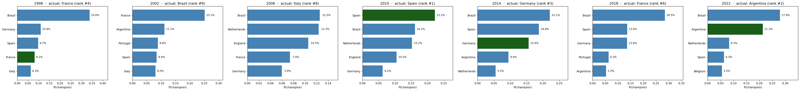

# Multi-tournament backtest

*Generated: 2026-06-11 01:45*
*Tournaments: 1998, 2002, 2006, 2010, 2014, 2018, 2022*

## Procedure

For each tournament, run the freeze-and-predict pipeline:

1. Filter the match history to before the tournament start.
2. Recompute Elo from scratch on that subset.
3. Refit the outcome model (multinomial logit on Elo diff features).
4. Run 10,000 Monte Carlo simulations using the actual groups + FIFA bracket.
5. Record where the actual champion ranks in the predicted P(champion) table.

## Summary

|   Year | Actual champion   |   Predicted rank | P(champion)   | P(semi)   |
|-------:|:------------------|-----------------:|:--------------|:----------|
|   1998 | France            |                4 | 8.1%          | 24.8%     |
|   2002 | Brazil            |                9 | 2.8%          | 13.2%     |
|   2006 | Italy             |                8 | 5.5%          | 21.9%     |
|   2010 | Spain             |                1 | 22.2%         | 48.9%     |
|   2014 | Germany           |                3 | 15.6%         | 46.9%     |
|   2018 | France            |                6 | 4.7%          | 21.6%     |
|   2022 | Argentina         |                2 | 21.3%         | 51.5%     |

## Verdict

Insufficient signal. Predicted champion in top 6 in only 5/7 years. Methodology needs work; consider adding features or recalibrating Elo K-factors.

## Reading the chart

Each panel shows the top-5 predicted teams for that tournament. The actual champion is highlighted in green. If green appears consistently within the top 5, the methodology has real signal across tournaments. If green only appears in one year, that year was likely lucky and the methodology is over-fitted to it.

## Known limitations

- **Team-name spelling drift.** 2014 and 2018 may use legacy spellings (IR Iran, Korea Republic, Cabo Verde). Verify via `python scripts/list_teams.py`.
- **Pre-tournament cutoff is approximate.** Backtests filter on tournament start date; strictly correct would freeze at squad-announcement date.
- **Surprise semi-final runs are not predicted.** Croatia 2018, Morocco 2022 are not expected to surface. Methodology is sound if it ranks the eventual *champion*, not necessarily the SF cast.
