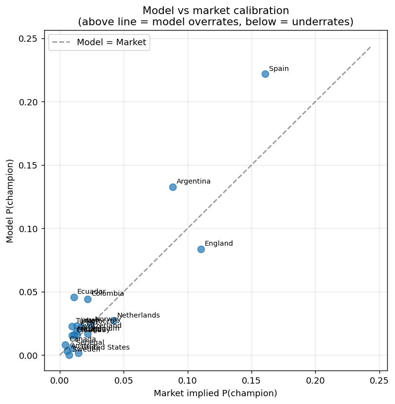
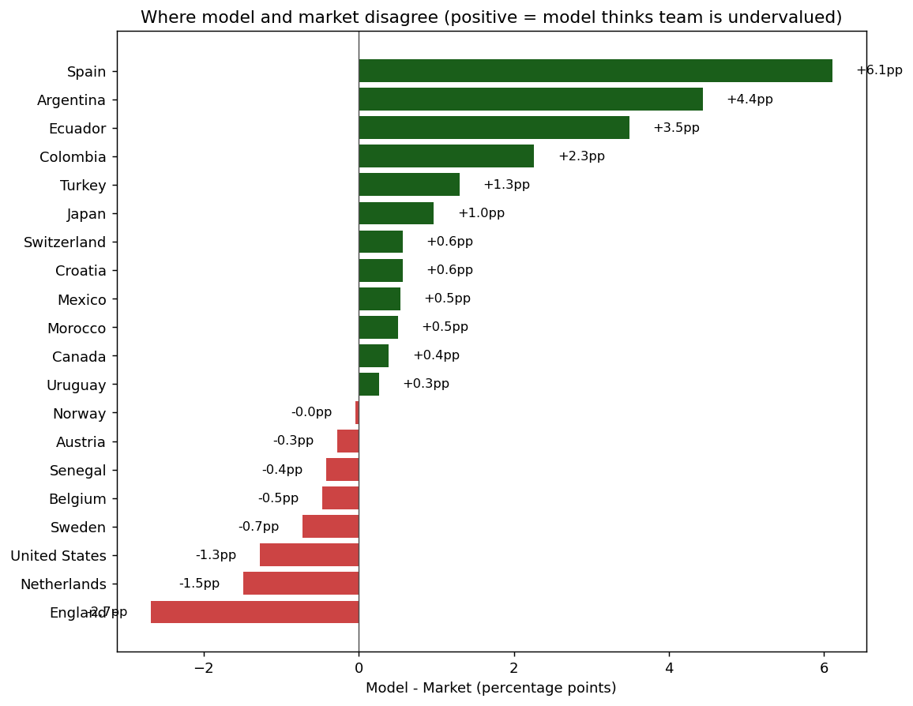

# Model vs Market - 2026 World Cup

*Generated: 2026-06-11 01:38*
*Book overround: 1.131 (1.0 = perfect; >1.05 typical for sportsbooks)*

## Summary

- **Most undervalued by market** (model > market): Spain (+6.1pp), Argentina (+4.4pp), Ecuador (+3.5pp)
- **Most overvalued by market** (model < market): England (-2.7pp), Netherlands (-1.5pp), United States (-1.3pp)

A positive diff means the model thinks the team is undervalued (potential bet). A negative diff means the market sees something the model does not - usually current form, injuries, or recent friendly results.

## Model vs market

| team          | model_p   | market_p   | diff   | ratio   |
|:--------------|:----------|:-----------|:-------|:--------|
| Spain         | 22.2%     | 16.1%      | +6.1%  | 1.38x   |
| Argentina     | 13.3%     | 8.8%       | +4.4%  | 1.50x   |
| Ecuador       | 4.6%      | 1.1%       | +3.5%  | 4.20x   |
| Colombia      | 4.4%      | 2.2%       | +2.3%  | 2.05x   |
| Turkey        | 2.3%      | 1.0%       | +1.3%  | 2.34x   |
| Japan         | 2.3%      | 1.3%       | +1.0%  | 1.72x   |
| Switzerland   | 1.9%      | 1.3%       | +0.6%  | 1.43x   |
| Croatia       | 1.5%      | 1.0%       | +0.6%  | 1.59x   |
| Mexico        | 1.6%      | 1.1%       | +0.5%  | 1.49x   |
| Morocco       | 2.2%      | 1.7%       | +0.5%  | 1.29x   |
| Canada        | 0.8%      | 0.4%       | +0.4%  | 1.89x   |
| Uruguay       | 1.6%      | 1.3%       | +0.3%  | 1.19x   |
| Norway        | 2.4%      | 2.5%       | -0.0%  | 0.98x   |
| Austria       | 0.3%      | 0.6%       | -0.3%  | 0.53x   |
| Senegal       | 0.5%      | 1.0%       | -0.4%  | 0.57x   |
| Belgium       | 1.7%      | 2.2%       | -0.5%  | 0.78x   |
| Sweden        | 0.0%      | 0.7%       | -0.7%  | 0.01x   |
| United States | 0.2%      | 1.4%       | -1.3%  | 0.12x   |
| Netherlands   | 2.7%      | 4.2%       | -1.5%  | 0.65x   |
| England       | 8.4%      | 11.1%      | -2.7%  | 0.76x   |

## How to use this

1. **Big positive diffs are either alpha or bugs.** Before betting, ask: does the model see Elo strength the market is missing, or is the model overrating high-Elo teams systematically? Cross-check against `compare_models.py` and `backtest_all.py`.
2. **Big negative diffs are market signals.** If the market prices Brazil 3pp higher than the model, the market knows something. Usually current form, injuries, or recent friendly results that pre-tournament Elo has not yet absorbed.
3. **Devigging method.** This script uses proportional devig (1/odds normalized). For high-margin books switch to Shin's method in `src/market.py`.

## Refresh the odds

`CURRENT_ODDS` at the top of `report_market.py` is a template. Replace with current decimal odds from Pinnacle, Betfair Exchange, or oddsportal.com.
