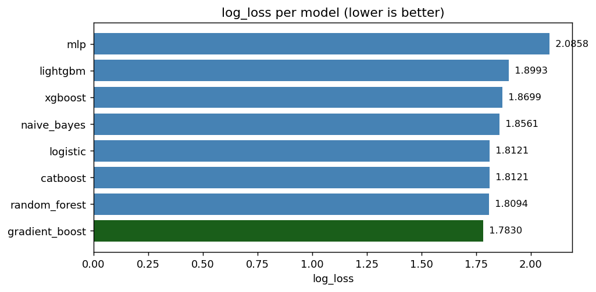
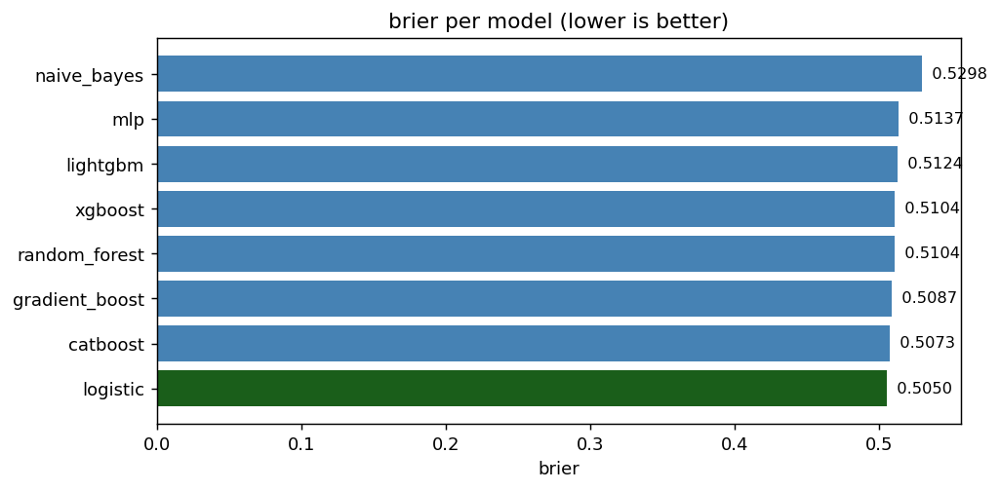
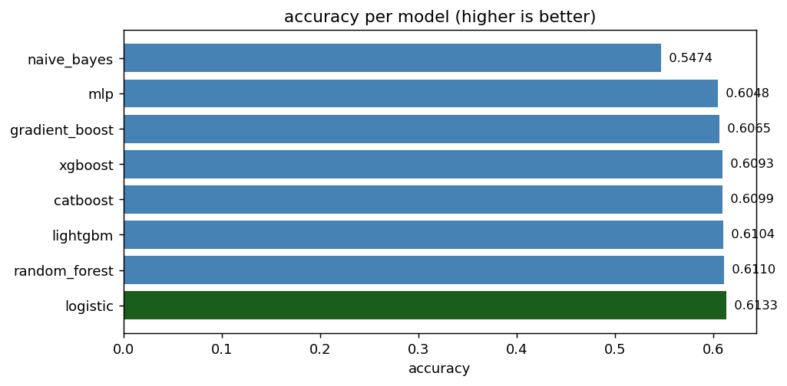

# ML model comparison

*Generated: 2026-06-11 10:48*

## Setup

- Train: 14,206 matches (2006-01-02 -> 2021-05-31)
- Test:  1,761 matches (2021-06-01 -> 2022-11-19)
- Features: `elo_diff, abs_elo_diff, is_friendly, is_wc, is_qualifier`
- Task: multinomial classification {H, D, A}

## Results

| model          |   log_loss |   brier |   accuracy |
|:---------------|-----------:|--------:|-----------:|
| gradient_boost |     1.7830 |  0.5087 |     0.6065 |
| random_forest  |     1.8094 |  0.5104 |     0.6110 |
| catboost       |     1.8121 |  0.5073 |     0.6099 |
| logistic       |     1.8121 |  0.5050 |     0.6133 |
| naive_bayes    |     1.8561 |  0.5298 |     0.5474 |
| xgboost        |     1.8699 |  0.5104 |     0.6093 |
| lightgbm       |     1.8993 |  0.5124 |     0.6104 |
| mlp            |     2.0858 |  0.5137 |     0.6048 |

## Verdict

gradient_boost beats logistic by 0.0291 log_loss. Worth swapping into the pipeline.

## Reading the gap

- All models tie within 0.005 log_loss -> **feature-limited**; add features (form, market value, xG).
- Gradient boosting wins by >0.01 -> non-linear interactions exist; swap GBM into the pipeline.
- MLP wins -> calibrate via `CalibratedClassifierCV` before swapping (probabilities may not be honest).
