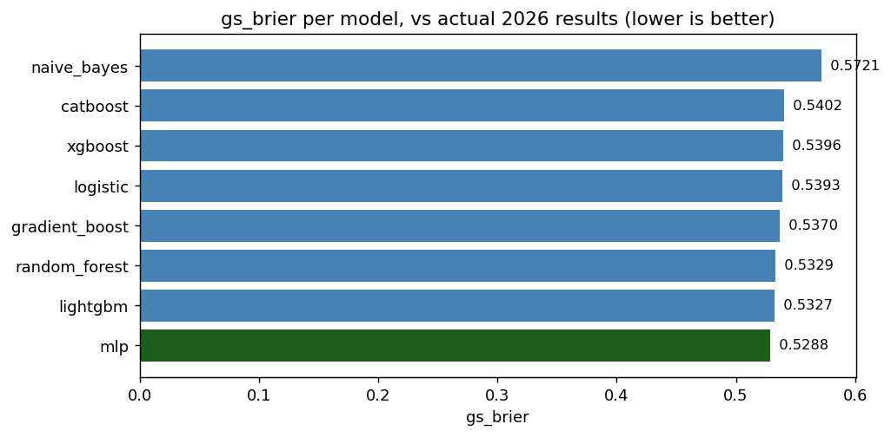
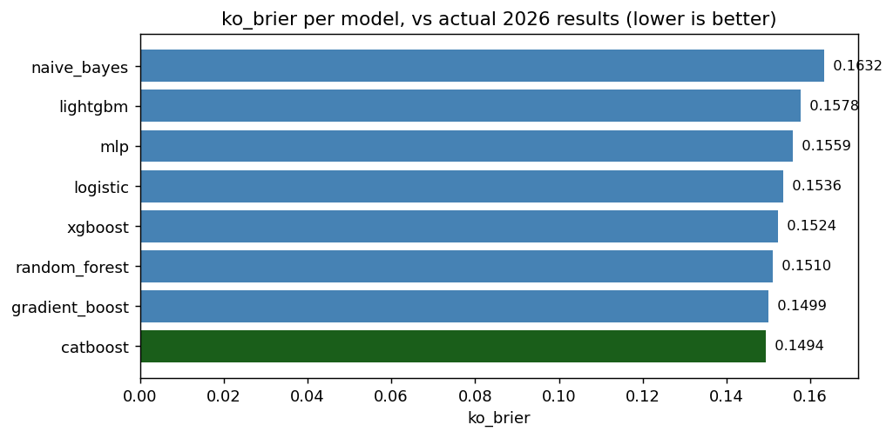
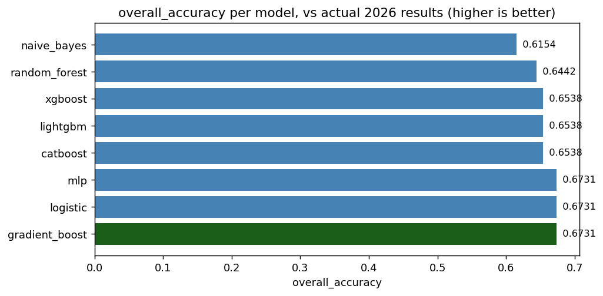

# Model zoo vs actual 2026 World Cup results

*Generated: 2026-07-20 13:05*

## Setup

- Train: 19,668 matches (2006-01-01 -> tournament start), same Elo/features as the production pipeline.
- Test: the actual 104 played matches of the 2026 World Cup (72 group + 32 knockout) -- **true
  out-of-sample**, since these results are not present anywhere in the training data.
- Features: `elo_diff, abs_elo_diff, is_friendly, is_wc, is_qualifier`
- Knockout probability = P(H) + 0.5*P(D), same penalty-shootout proxy the production model uses.

## Results

| model          |   group_acc |   group_brier |   ko_acc |   ko_brier |   overall_acc |
|:---------------|------------:|--------------:|---------:|-----------:|--------------:|
| catboost       |      0.5972 |        0.5402 |   0.7812 |     0.1494 |        0.6538 |
| gradient_boost |      0.6111 |        0.5370 |   0.8125 |     0.1499 |        0.6731 |
| random_forest  |      0.5833 |        0.5329 |   0.7812 |     0.1510 |        0.6442 |
| xgboost        |      0.5972 |        0.5396 |   0.7812 |     0.1524 |        0.6538 |
| logistic       |      0.6250 |        0.5393 |   0.7812 |     0.1536 |        0.6731 |
| mlp            |      0.6250 |        0.5288 |   0.7812 |     0.1559 |        0.6731 |
| lightgbm       |      0.5972 |        0.5327 |   0.7812 |     0.1578 |        0.6538 |
| naive_bayes    |      0.5556 |        0.5721 |   0.7500 |     0.1632 |        0.6154 |

## Verdict

catboost edges out logistic by only 0.0042 knockout Brier on 32 matches -- within noise for a sample this small. Not enough evidence to swap the production model.

## Reading this vs report_models.py

`report_models.py` scores algorithms on a 2021-2022 slice of *historical* matches the model
never trained on, but which existed at training time in principle. This report scores against
2026 results that postdate every training example -- a stronger, later-in-time test. Treat
`report_models.py` as the "which algorithm is more principled" check and this report as the
"how did the live pick actually do" check.
